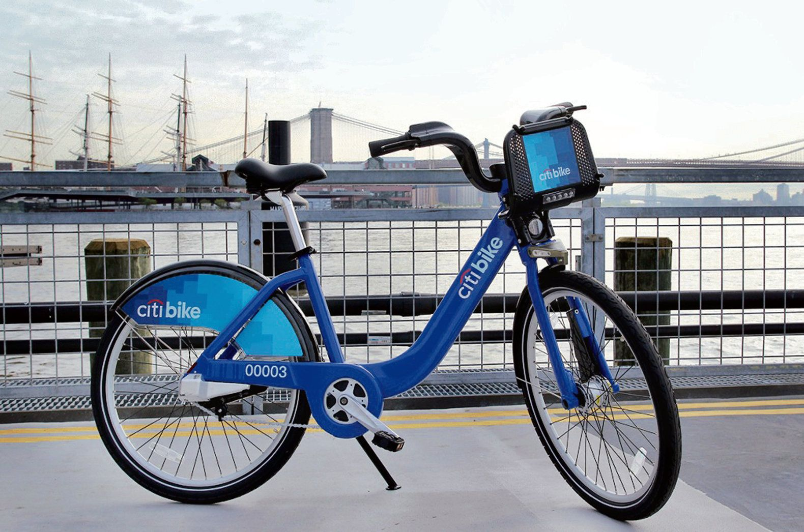

# Tableau Challenge - Citi Bike Analytics 2019-2020

## Interactive Version of the Analysis
https://waghrayrashi-houseprices.herokuapp.com/

https://public.tableau.com/profile/oleksandra.ianchevska#!/vizhome/CityBikeReport/CitiBike2019-20Analysis?publish=yes

##             :bike: Background :bike:

Since 2013, the Citi Bike Program has implemented a robust infrastructure for collecting data on the program's utilization. Through the team's efforts, each month bike data is collected, organized, and made public on the [Citi Bike Data](https://www.citibikenyc.com/system-data) webpage.

However, while the data has been regularly updated, the team has yet to implement a dashboard or sophisticated reporting process. City officials have a number of questions on the program, so your first task on the job is to build a set of data reports to provide the answers.

## Task :thinking:

** A task in this assignment is to aggregate the data found in the Citi Bike Trip History Logs and find two unexpected phenomena.** 

**Design 2-5 visualizations for each discovered phenomena.
**The following are some questions to answer in the analysis**

* How many trips have been recorded total during the chosen period?

* By what percentage has total ridership grown?

* How has the proportion of short-term customers and annual subscribers changed?

* What are the peak hours in which bikes are used during summer months?

* What are the peak hours in which bikes are used during winter months?

* Today, what are the top 10 stations in the city for starting a journey? (Based on data, why do you hypothesize these are the top locations?)

* Today, what are the top 10 stations in the city for ending a journey? (Based on data, why?)

* Today, what are the bottom 10 stations in the city for starting a journey? (Based on data, why?)

* Today, what are the bottom 10 stations in the city for ending a journey (Based on data, why?)

* Today, what is the gender breakdown of active participants (Male v. Female)?

* How effective has gender outreach been in increasing female ridership over the timespan?

* How does the average trip duration change by age?

* What is the average distance in miles that a bike is ridden?

* Which bikes (by ID) are most likely due for repair or inspection in the timespan?

* How variable is the utilization by bike ID?

* Create a Tableau story that brings together the visualizations, requested maps, and dashboards.

* This is what will be presented to the officials, so be sure to make it professional, logical, and visually appealing. 

